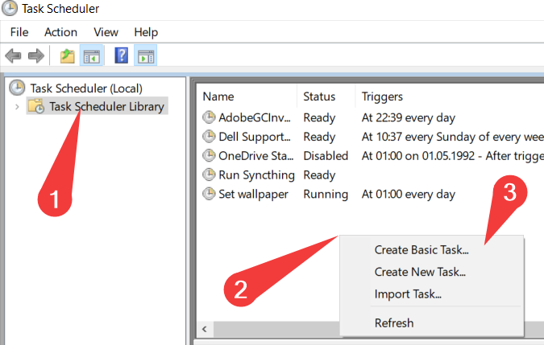
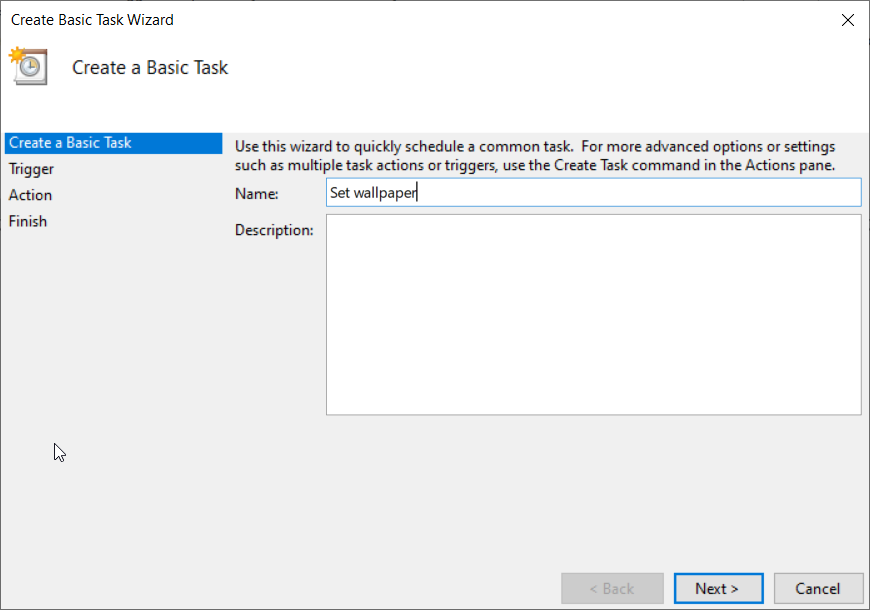
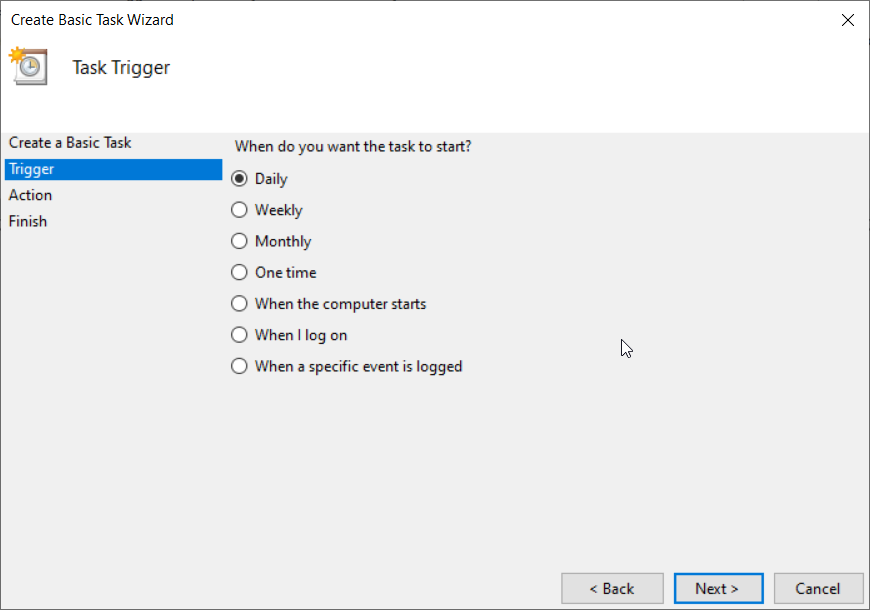
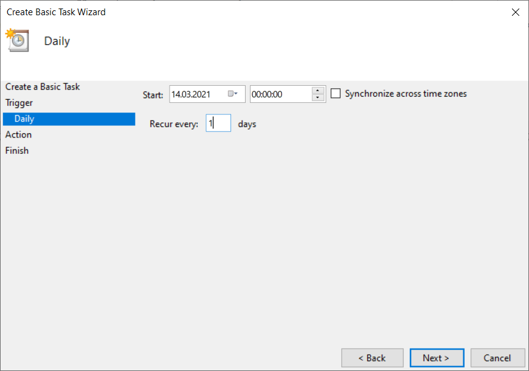
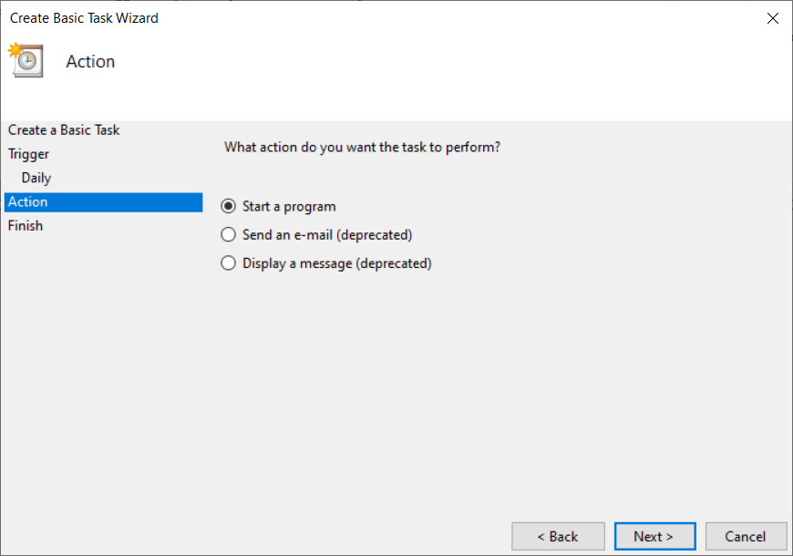
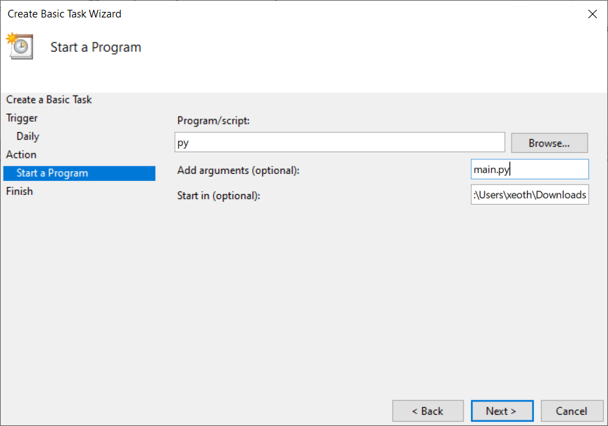
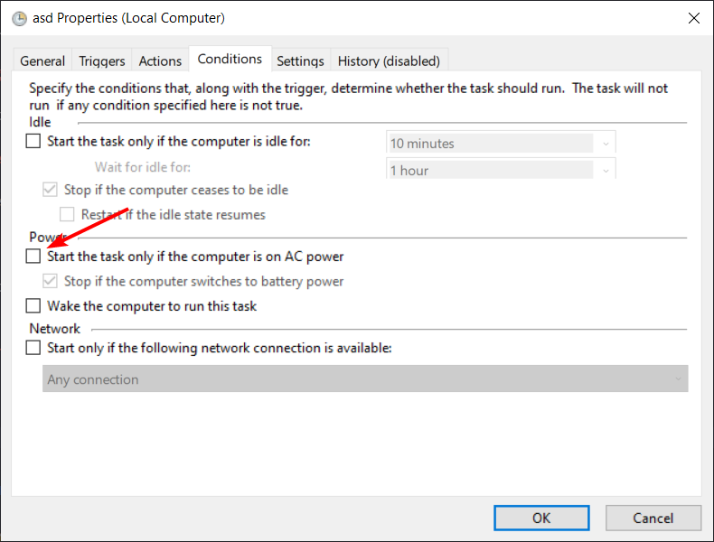
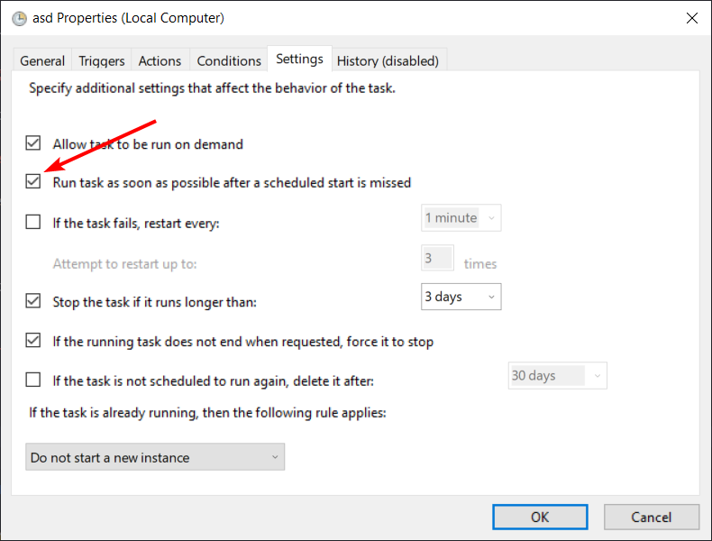

# Daily Wallpaper

Downloads an image from a list of subreddits, then sets is as a wallpaper.

## Config

In `main.py`:

* `SUBREDDITS` - A tuple with subreddits you want to fetch images from
* `MODE` - Either *random* or *multireddit*. *Random* fetches a picture from one of the specified subreddits, while *multireddit* fetches a picture from every specified subreddit.
* `MIN_HEIGHT`, `MIN_WIDTH` - Minimum height and width of the wallpaper. You should probably set it at your screen resultion.

## Setting It Up

1.  Get Python >= 3.8 Download the `main.py` file, install the `requests` library using `pip`.
2. Open Task Scheduler (ctrl+r, then type in `taskschd.msc`)
3. Click on Task Scheduler Library on the left sidebar, then right click on the top field and click "Create Basic Task"

4. Enter a name, like "Set wallpaper"

5. Select the "Daily" trigger (or any other)

6. Set the start hour to midnight and enter "1" in "Recur every ___ days".

7. Keep "Start a program" selected

8. Enter `py` in the "Program/script" field, `main.py` in the "Add arguments" field, and the path to __the folder__ in which the script sits in the "Start in" field.

9. Click "Next" one last time, confirm everything is in order, check the "Open properties" checkbox and click "Finish"

10. In the properties window, go to the "Conditions" tab and uncheck "Start the task only if the computer is on AC power"

11. Go to the "Settings" tab and check "Run task as soon as possible after a scheduled start is missed"

